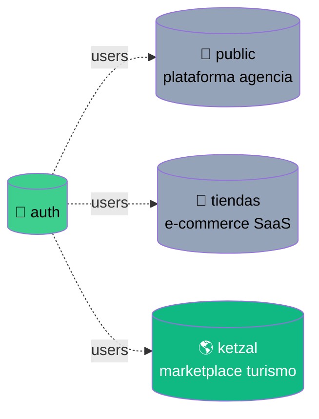
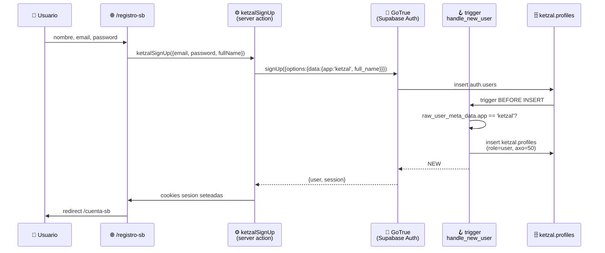

<div align="center">

# 🌎 Ketzal App

**Marketplace de experiencias turísticas en México**
_B2C donde turistas reservan tours, hospedaje y productos · operadores administran su catálogo · pagos en MXN + AXO Coins_

[](https://nextjs.org/)
[](https://react.dev/)
[](https://www.typescriptlang.org/)
[](https://supabase.com/)
[](https://tailwindcss.com/)
[](https://vercel.com/)
[](https://supabase.com/)

</div>

---

## 📑 Tabla de contenidos

- [✨ TL;DR](#-tldr)
- [🏛️ Arquitectura](#️-arquitectura)
- [🗄️ Modelo de datos](#️-modelo-de-datos)
- [🔐 Autenticación](#-autenticación)
- [🛡️ Row Level Security](#️-row-level-security)
- [🧩 Stack técnico](#-stack-técnico)
- [📁 Estructura del repo](#-estructura-del-repo)
- [🚀 Getting started](#-getting-started)
- [🌐 Despliegue](#-despliegue)
- [🧪 Testing](#-testing)
- [🗺️ Roadmap](#️-roadmap)
- [📚 Convenciones](#-convenciones)

---

## ✨ TL;DR

Ketzal NO es un e‑commerce clásico. Tiene **tres piezas** que reemplazan/extienden el carrito tradicional:

| Pieza | Qué hace |
|---|---|
| 🧭 **TravelPlanner** | Sustituye al carrito. Un usuario tiene múltiples planners (por viaje/destino), con estados `PLANNING → RESERVED → CONFIRMED → TRAVELLING → COMPLETED` |
| 💰 **Wallet** | Saldo dual: **MXN** (pesos) + **AXO Coins** (moneda interna gamificada). 50 AXO de bienvenida en cada signup. **5 RPCs `SECURITY DEFINER` + `SELECT FOR UPDATE`** garantizan operaciones atomicas anti-fraude |
| 💖 **Wishlist** | Listas compartibles vía `share_code` + alertas de precio |
| 🔔 **Notifications** | **Realtime via `supabase.channel`** — badge unread sin polling |

Vive como **inquilino dedicado** dentro del Supabase compartido de **Gorilla‑Labs** (la oficina virtual de la casa matter), aprovechando el sistema de auth y la infra existente sin pisarse con la app de agencia ni con `tiendas`.

🎯 **Refactor lvl 2 completo**: backend 100% Supabase, NextAuth retirado (shim compat), data layer migrado a supabase-js, wallet con RPCs transaccionales, notifications realtime.

---

## 🏛️ Arquitectura

```mermaid
flowchart LR
    user([👤 Usuario])
    browser[🌐 Next.js App<br/>App Router + RSC]
    middleware[🛡️ Middleware<br/>NextAuth gate + Supabase refresh]
    actions[⚙️ Server Actions<br/>lib/supabase/auth-actions.ts]
    supaAuth[(🔐 auth.users<br/>Supabase Auth)]
    supaDB[(🗄️ ketzal schema<br/>14 tablas + RLS)]
    trigger{{🪝 on_auth_user_created<br/>handle_new_user app-aware}}
    cloudinary[(☁️ Cloudinary<br/>Imágenes)]

    user --> browser
    browser <-->|cookies| middleware
    browser -->|@supabase/supabase-js| supaDB
    browser -->|server action| actions
    actions -->|@supabase/ssr| supaAuth
    actions -->|@supabase/ssr| supaDB
    supaAuth -->|on insert| trigger
    trigger -->|app=ketzal| supaDB
    browser --> cloudinary

    style supaDB fill:#3ECF8E,color:#000
    style supaAuth fill:#3ECF8E,color:#000
    style trigger fill:#FFD93D,color:#000
```

**Lo clave:**
- **Identidad compartida**: `auth.users` es UNA tabla, usada por la oficina (agencia), `tiendas` y Ketzal. El trigger `handle_new_user` es **app‑aware**: si el signup trae `raw_user_meta_data.app = 'ketzal'`, crea solo el perfil Ketzal; cualquier otro signup mantiene el flujo de agencia.
- **Aislamiento por schema**: todo lo de Ketzal vive en `ketzal.*` (igual que `tiendas.*`). Cero colisión con las 21 tablas de `public.*` de la agencia.
- **RLS como puerta**: el cliente del navegador habla directo a Supabase con la anon key; las 36 políticas RLS deciden quién ve qué.

---

## 🗄️ Modelo de datos

### Schemas vivos en el proyecto Supabase



### ER del schema `ketzal`

```mermaid
erDiagram
    auth_users ||--o| profiles : "1:1 (via trigger)"
    profiles }o--|| suppliers : "supplier_id"
    suppliers ||--o{ services : "supplier_id"
    suppliers ||--o{ services : "transport_provider_id"
    suppliers ||--o{ services : "hotel_provider_id"
    services ||--o{ reviews : "service_id"
    auth_users ||--o{ reviews : "user_id"
    services ||--o{ planner_items : ""
    products ||--o{ planner_items : ""
    services ||--o{ wishlist_items : ""
    products ||--o{ wishlist_items : ""
    auth_users ||--o{ travel_planners : "user_id"
    travel_planners ||--o{ planner_items : "planner_id"
    auth_users ||--o{ wishlists : "user_id"
    wishlists ||--o{ wishlist_items : "wishlist_id"
    auth_users ||--|| wallets : "user_id"
    wallets ||--o{ wallet_transactions : "wallet_id"
    auth_users ||--o{ payments : "user_id"
    travel_planners ||--o{ payments : "planner_id"
    auth_users ||--o{ notifications : "user_id"

    auth_users {
        uuid id PK
        text email
        jsonb raw_user_meta_data "app=ketzal"
    }
    profiles {
        uuid id PK_FK
        text email
        text name
        user_role role "user|admin|superadmin"
        numeric axo_coins_earned "default 50"
        uuid supplier_id FK
    }
    suppliers {
        uuid id PK
        text name UK
        text contact_email UK
        text supplier_type
        jsonb location
        jsonb photos
    }
    services {
        uuid id PK
        uuid supplier_id FK
        uuid transport_provider_id FK
        uuid hotel_provider_id FK
        text name
        numeric price
        numeric price_axo
        text service_type
        jsonb images
        int max_capacity
    }
    products {
        uuid id PK
        text name UK
        numeric price
        numeric price_axo
        int stock
    }
    travel_planners {
        uuid id PK
        uuid user_id FK
        planner_status status "PLANNING -> COMPLETED"
        numeric total_mxn
        numeric total_axo
        bool is_public
        text share_code UK
    }
    planner_items {
        uuid id PK
        uuid planner_id FK
        uuid service_id FK
        uuid product_id FK
        int quantity
        numeric price_mxn
    }
    wallets {
        uuid id PK
        uuid user_id FK_UK
        numeric balance_mxn
        numeric balance_axo
    }
    wallet_transactions {
        uuid id PK
        uuid wallet_id FK
        wallet_txn_type type
        numeric amount_mxn
        numeric amount_axo
    }
    payments {
        uuid id PK
        uuid user_id FK
        uuid planner_id FK
        payment_status status
        int installments
        int current_installment
    }
    notifications {
        uuid id PK
        uuid user_id FK
        notification_type type
        notification_priority priority
        bool is_read
        jsonb metadata
    }
```

### 📊 Tablas del schema `ketzal`

| Tabla | Propósito | Vive de | RLS |
|---|---|---|---|
| `profiles` | Datos Ketzal por usuario (rol, AXO, supplier_id) | 1:1 con `auth.users` | dueño select/update |
| `suppliers` | Proveedores turísticos | catálogo público | public read, owner write |
| `categories` | Catálogo de categorías | catálogo público | public read, superadmin write |
| `products` | Tienda (shop items) | catálogo público | public read, superadmin write |
| `services` | Tours/experiencias (3 FKs a suppliers) | catálogo público | public read, owner write |
| `reviews` | Reseñas con rating 1‑5 | usuarios autenticados | public read, author write |
| `travel_planners` | Carritos por viaje (con estados) | privado/compartible | owner + public si `is_public` |
| `planner_items` | Items dentro de un planner | derivado del padre | hereda del planner |
| `wishlists` | Listas compartibles | privado/compartible | owner + public si `is_public` |
| `wishlist_items` | Items dentro de wishlist | derivado | hereda del wishlist |
| `wallets` | Saldo MXN + AXO | privado | **dueño solo lectura**, write via service_role |
| `wallet_transactions` | Historial | privado | **dueño solo lectura**, write via service_role |
| `payments` | Pagos con cuotas | privado | **dueño solo lectura**, write via service_role |
| `notifications` | Avisos al usuario | privado | dueño lee/marca/borra, write via service_role |

### 🏷️ Enums

| Enum | Valores |
|---|---|
| `user_role` | `user`, `admin`, `superadmin` |
| `planner_status` | `PLANNING`, `RESERVED`, `CONFIRMED`, `TRAVELLING`, `COMPLETED` |
| `payment_status` | `PENDING`, `PARTIAL`, `COMPLETED`, `REFUNDED` |
| `wallet_txn_type` | `DEPOSIT`, `WITHDRAWAL`, `PURCHASE`, `REFUND`, `TRANSFER_SENT`, `TRANSFER_RECEIVED`, `REWARD` |
| `notification_type` | `INFO`, `SUCCESS`, `WARNING`, `ERROR`, `SUPPLIER_APPROVAL`, `USER_REGISTRATION`, `WELCOME_BONUS`, `WELCOME_MESSAGE`, `BOOKING_UPDATE`, `SYSTEM_UPDATE` |
| `notification_priority` | `LOW`, `NORMAL`, `HIGH`, `URGENT` |

### 🧰 Funciones SQL en `ketzal`

**Helpers RLS** (SECURITY DEFINER, evitan recursión):

| Función | Devuelve | Para qué |
|---|---|---|
| `ketzal.is_superadmin()` | `boolean` | RLS check rápido en políticas |
| `ketzal.my_supplier_id()` | `uuid` | El supplier que administra el usuario logueado |
| `ketzal.set_updated_at()` | `trigger` | Mantiene `updated_at = now()` automático |

**💰 Wallet RPCs** (SECURITY DEFINER + `SELECT FOR UPDATE` — única vía de mutar saldos):

| RPC | Garantía |
|---|---|
| `wallet_ensure(p_user_id?)` | get-or-create idempotente |
| `wallet_add_funds(mxn, axo, desc, ref?, type)` | deposita + log txn |
| `wallet_purchase(mxn, axo, desc, ref?)` | valida saldo + descuenta |
| `wallet_transfer(to_user, mxn, axo, desc, ref?)` | atomico + **lock determinista por user_id::text** (anti-deadlock cruzado) |
| `wallet_convert(from_currency, amount, rate, desc?)` | MXN ↔ AXO |

Todas retornan `jsonb {success, wallet?, message?, transactionId?}`.

**🔔 Notification RPC** (anti self-spam):

| RPC | Garantía |
|---|---|
| `notification_create_self(title, msg, type, priority, metadata?, action_url?)` | INSERT atado a `auth.uid()` — única vía de crear notification desde cliente |

**📡 Realtime publication:** `ketzal.notifications` agregada a `supabase_realtime` → broadcast de INSERT/UPDATE/DELETE a clientes suscritos con `supabase.channel('notif:userId').on('postgres_changes', filter='user_id=eq.userId', ...)`.

### 🪝 Trigger compartido `public.handle_new_user`

Corre en CADA `INSERT` sobre `auth.users` (todos los signups del proyecto). **Es app‑aware**:

```sql
if (new.raw_user_meta_data->>'app') = 'ketzal' then
  insert into ketzal.profiles (id, email, name) values (...);
  return new;
end if;

-- Comportamiento original de la agencia (sin cambios):
insert into public.organizations (...) returning id into new_org_id;
insert into public.org_members (...);
perform public.seed_org_agents(new_org_id);
perform public.claim_orphan_resources(new_org_id);
```

➡️ Un alta de Ketzal NO contamina la tabla `organizations` con workspaces de agencia.

---

## 🔐 Autenticación

### Flujo signup desde Ketzal



### Páginas canónicas Supabase

| Ruta | Componente |
|---|---|
| `/register` ó `/registro-sb` | [`SupabaseRegisterForm`](components/supabase-register-form.tsx) — signup con `app:'ketzal'` |
| `/login` ó `/login-sb` | [`SupabaseLoginForm`](components/supabase-login-form.tsx) — password grant |
| `/cuenta-sb` | Server component — `getKetzalUser()` muestra rol/email/AXO, logout |

### NextAuth retirado ✅

NextAuth removido por completo. Las viejas importaciones se redirigen a un **shim compat** en `lib/auth/` que mantiene la misma API pero usa Supabase Auth por debajo:

| Antes | Ahora |
|---|---|
| `import { auth } from "@/auth"` | `import { auth } from "@/lib/auth/server"` |
| `import { useSession, signOut } from "next-auth/react"` | `import { useSession, signOut } from "@/lib/auth/client"` |

El shim devuelve la shape de NextAuth (`{user, accessToken, expires}`) enriqueciendo `auth.users` con datos de `ketzal.profiles` (role, supplierId). `useSession` suscribe a `onAuthStateChange` para refresh automático.

---

## 🛡️ Row Level Security

**Todas las 14 tablas tienen RLS habilitado.** 36 políticas activas. Patrones:

- 🌐 **Catálogo público** (`suppliers`, `categories`, `products`, `services`, `reviews`): SELECT `using (true)` → cualquiera lee.
- ✍️ **Catálogo controlado**: INSERT/UPDATE/DELETE solo `ketzal.is_superadmin()` o `services.supplier_id = ketzal.my_supplier_id()` (el dueño del supplier).
- 👤 **Datos del usuario** (`profiles`, `travel_planners`, `wishlists`, `notifications`): `auth.uid() = user_id` para R/W. Planners y wishlists tienen lectura adicional si `is_public = true`.
- 🔗 **Items de padres** (`planner_items`, `wishlist_items`): heredan el acceso del planner/wishlist padre via `EXISTS`.
- 💰 **Dinero solo lectura del dueño** (`wallets`, `wallet_transactions`, `payments`): SELECT al dueño y superadmin. **Cero política de write para autenticados** → todas las mutaciones deben pasar por backend con `service_role` (que bypassa RLS). Esto **previene fraude por modificación directa de saldos** desde el cliente.

---

## 🧩 Stack técnico

<table>
<tr><td>

**Frontend**
- ⚛️ Next.js 15 (App Router)
- 🦾 React 18 + TypeScript estricto
- 🎨 Shadcn/UI (Radix) + Tailwind 3
- 🧠 React Hook Form + Zod
- 📦 Zustand (legacy, contextos)

</td><td>

**Backend / Data**
- 🐘 PostgreSQL via **Supabase**
- 🔐 **Supabase Auth** (`auth.users`, GoTrue)
- 📚 `@supabase/supabase-js` + `@supabase/ssr`
- 🪪 NextAuth v5 beta (en migración a Supabase)
- 🛠️ Prisma (legacy, en retiro)

</td><td>

**Infra**
- ▲ Vercel (deploy)
- ☁️ Cloudinary (imágenes)
- ✉️ Resend (email, lazy init)
- 🧪 Jest + ts-jest + Testing Library

</td></tr>
</table>

---

## 📁 Estructura del repo

```
ketzal-app/
├── 📱 app/
│   ├── (auth)/              ← login, registro, forgot/reset password
│   │   ├── login-sb/        🆕 Supabase login
│   │   ├── registro-sb/     🆕 Supabase registro
│   │   └── cuenta-sb/       🆕 Account view (proof E2E)
│   ├── (protected)/         ← sesión requerida (services, users, suppliers, super-admin)
│   ├── (public)/            ← abiertas (tours, store, planners, wallet)
│   └── api/                 ← API Routes
├── ⚙️ actions/              ← Server Actions ("use server") — legacy NextAuth
├── 🧩 components/
│   ├── ui/                  ← primitivos shadcn
│   ├── travel-planner/      ← Sidebar, AddToPlanner, SeatSelector
│   ├── supabase-login-form  🆕 Form Supabase
│   └── supabase-register-form 🆕
├── 🔌 lib/
│   ├── supabase/            🆕 cliente browser/server/middleware + auth-actions + types
│   │   ├── client.ts        🌐 browser (createBrowserClient)
│   │   ├── server.ts        🖥️ server (createServerClient + cookies)
│   │   ├── middleware.ts    🔄 updateSession helper
│   │   ├── auth-actions.ts  ketzalSignUp/SignIn/SignOut/getKetzalUser
│   │   ├── services-api.ts  fetchKetzalTours (browser fetch público)
│   │   └── database.types.ts (generados del schema ketzal)
│   ├── mail.ts              ← Resend lazy (no crashea sin AUTH_RESEND_API_KEY)
│   ├── zod.ts               ← schemas (phone E.164 normalize)
│   └── ...
├── 🌐 middleware.ts          ← NextAuth gating + updateSession Supabase compuestos
├── 🔐 auth.ts / auth.config.ts ← NextAuth v5 (JWT)
├── 📜 prisma/                ← schema legacy + migrations
├── 📚 docs/
│   ├── SUPABASE_INTEGRATION_PLAN.md ← plan completo de la migración
│   └── sql/
│       ├── phase1_ketzal_schema.sql 🗄️ schema + profiles + trigger app-aware
│       ├── phase2_ketzal_catalog.sql 🛒 suppliers/services/products/...
│       └── phase3_ketzal_domain.sql 💰 planners/wallets/payments/notifs
├── 🧪 __tests__/             ← Jest (zod, planners-api, auth-action, super-admin, wallet)
├── 🔧 scripts/
│   ├── check-secrets-expiry.mjs ← `npm run check:secrets`
│   └── supabase-smoke.mjs
└── 🗝️ config/secrets-expiry.json ← metadata-only, sin valores
```

---

## 🚀 Getting started

### 1. Pre‑requisitos

- Node.js ≥ 18 (recomendado 20+)
- Cuenta de Supabase con acceso al proyecto `Gorilla-Labs` (`wnujoyzdpdyxblgdtxjw`)
- (Opcional) Cuenta Cloudinary + Resend para features completas

### 2. Variables de entorno

Crear `.env.local` (gitignored):

```env
# Supabase (público — anon key va al bundle del browser)
NEXT_PUBLIC_SUPABASE_URL=https://wnujoyzdpdyxblgdtxjw.supabase.co
NEXT_PUBLIC_SUPABASE_ANON_KEY=<anon key del dashboard Supabase>

# NextAuth (legacy, hasta retirar)
NEXTAUTH_URL=http://localhost:3000
NEXTAUTH_SECRET=<openssl rand -base64 32>
AUTH_RESEND_API_KEY=<opcional — sin esto el envío de email solo no funciona>

# Cloudinary (opcional, para subir imágenes)
CLOUDINARY_CLOUD_NAME=...
CLOUDINARY_API_KEY=...
CLOUDINARY_API_SECRET=...
```

### 3. Instalar y correr

```bash
npm install
npm run dev          # localhost:3000
```

### 4. Comandos útiles

```bash
npm run dev              # next dev
npm run dev:turbo        # next dev --turbopack
npm run build            # build de producción
npm run lint             # ESLint
npm run test             # Jest
npm run test:watch
npm run test:coverage
npm run check:secrets    # Alertas de expiración de credenciales
```

---

## 🌐 Despliegue

Producción en **Vercel**. Auto‑deploy desde `main`.

**Env vars en Vercel** (todas en Production/Preview/Development):
- `NEXT_PUBLIC_SUPABASE_URL`
- `NEXT_PUBLIC_SUPABASE_ANON_KEY`
- `NEXTAUTH_SECRET`, `NEXTAUTH_URL` (mientras coexista NextAuth)
- `AUTH_RESEND_API_KEY` (opcional, lazy init no crashea sin él)
- `CLOUDINARY_*`

**Notas:**
- `eslint.ignoreDuringBuilds = true` en [next.config.ts](next.config.ts) — el lint corre con `npm run lint`, no bloquea deploy.
- `**/BU/**` excluido del typecheck (carpetas de código archivado).

---

## 🧪 Testing

- **Framework**: Jest + ts-jest, `testEnvironment: 'node'`.
- **Convenciones**: tests en `__tests__/` espejando estructura de origen.
- **Estado**: 4 suites, ~38 tests verdes cubriendo:
  - Schemas Zod (sign‑in, sign‑up, sign‑up admin con normalización E.164)
  - Server Actions: `registerAction`, `super-admin-actions`
  - API routes: `GET /api/wallet`
  - `planners-api` (proxy fetch)

---

## 🗺️ Roadmap

> 🎯 **Estado actual**: DB + auth Supabase desplegados en prod. Web carga. Auth nuevo conviviendo con NextAuth.

### ✅ Refactor lvl 2 — completo

| # | Item | Estado |
|---|---|---|
| 1 | **Data layer a supabase-js** (7 api.ts + consumers) | ✅ done |
| 2 | **Retirar NextAuth** (shim compat + bulk swap + delete + drop deps) | ✅ done |
| 3 | **RPCs wallet** (5 SECURITY DEFINER + SELECT FOR UPDATE) | ✅ done |
| 4 | **Realtime notifications** (channel + RPC self-create) | ✅ done |
| 5 | **Rewrite `/tours/[id]`** sin `as any` (ServiceFull tipado) | ✅ done |

### 🔥 Pendiente — Refactor lvl 3

| # | Item | Por qué | Impacto |
|---|---|---|---|
| 1 | **Email confirmation toggle** | Hoy OFF en Supabase Dashboard (sesión inmediata). Para prod B2C, encender + callback handler. | Bajo |
| 2 | **Rotar token Supabase** | El de management quedó expuesto en chat (ya expira 2026‑06‑26 — se rota igual). | Crítico (seguridad) |
| 3 | **Suppliers self‑management** | Que un `admin` pueda editar SU supplier desde el dashboard. RLS permite, falta UI. | Medio |
| 4 | **Rewrite componentes legacy** | `HotelInfo`, `TransportProvider`, `OrganizedBy`, `TourLocation` aún con shapes del backend viejo. Cast `as unknown as Parameters<...>` en `/tours/[id]` los disfraza. | Medio |
| 5 | **Cobertura tests** | Wallet RPCs (con mock service_role), realtime, planners flow, UI components con `@testing-library/react`. | Medio |
| 6 | **Service worker / PWA** | Push notifications mobile vía service worker + realtime. | Bajo |

### 🌱 Fase futura — Producto

- 🎯 **Programa de fidelidad con AXO Coins** (badges, leaderboard)
- 🤝 **Pagos en cuotas con pasarela real** (Stripe / MercadoPago)
- 🌐 **Compartir wishlists/planners en redes sociales** (OG dinámico)
- 📱 **PWA / app móvil** (Expo + reuso de supabase-js)

---

## 📚 Convenciones

- **Mutaciones → Server Actions** en `actions/*.ts` o `lib/supabase/auth-actions.ts` con `"use server"`. API Routes solo para integraciones (uploads, webhooks).
- **Cliente Supabase**: importar de `@/lib/supabase/client` (browser) o `@/lib/supabase/server` (SSR/Server Actions).
- **Auth shim**: importar de `@/lib/auth/server` (server) o `@/lib/auth/client` (client). API NextAuth-compat sobre Supabase.
- **Cliente Prisma (legacy)**: `@/lib/db` singleton. **En retiro** — preferir supabase-js para código nuevo.
- **Validación**: Zod en [lib/zod.ts](lib/zod.ts). Phone se normaliza a dígitos E.164 (10‑15) automáticamente.
- **PostgREST aliasing**: usar `select('aliasJS:column_db, ...')` para devolver camelCase. Combinar con `.returns<T>()` para que supabase-js infiera tipos.
- **Casts `as never`**: en `.insert(row)` / `.update(patch)` para puentear Database type genérico cuando se usa Record<string, unknown>.
- **Boundary casts**: usar `as unknown as Parameters<typeof Comp>[0]['prop']` (estrecho, autodocumentado) en vez de `as any`. Marca explícitamente la deuda hasta rewrite.
- **Imágenes**: Cloudinary vía `lib/cloudinary.ts`; mostrar con `<OptimizedImage>` / `<CloudinaryImage>`.
- **Notificaciones**: cliente crea via RPC `notification_create_self` (auto-spam protection). Lee/marca/borra con RLS directo.
- **Wallet**: cliente lee con RLS. Mutaciones solo via RPCs `wallet_*` (SECURITY DEFINER + SELECT FOR UPDATE).
- **Naming en `ketzal.*`**: snake_case (alineado con la plataforma). camelCase en código TS via PostgREST aliasing.
- **Comentarios `ponytail:`**: marcan simplificaciones deliberadas con su camino de upgrade. Respetarlos.

---

## 🤝 Contributing

1. Fork → branch desde `main`.
2. `npm run test` + `npm run lint` deben pasar (lint no bloquea deploy pero sí PR).
3. Tipos: `npx tsc --noEmit` clean.
4. Commits: español + conventional ish (`feat:`, `fix:`, `docs:`).

---

<div align="center">

**Ketzal** es un experimento de **Gorilla‑Labs** 🦍 — la oficina virtual de la casa matter.
Operando en el mismo Supabase que la agencia y `tiendas`, pero con su propio universo en `ketzal.*`.

</div>
